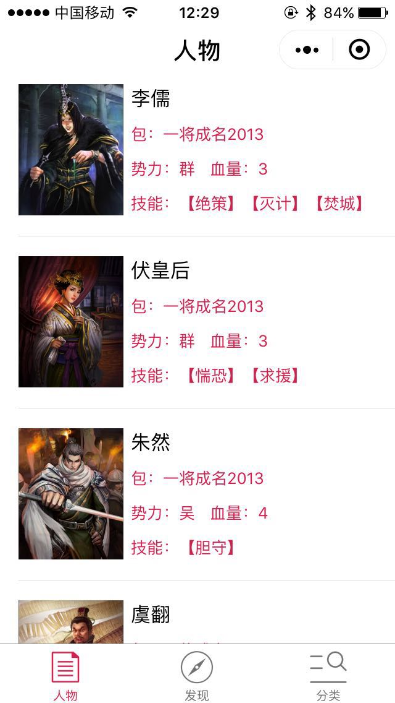
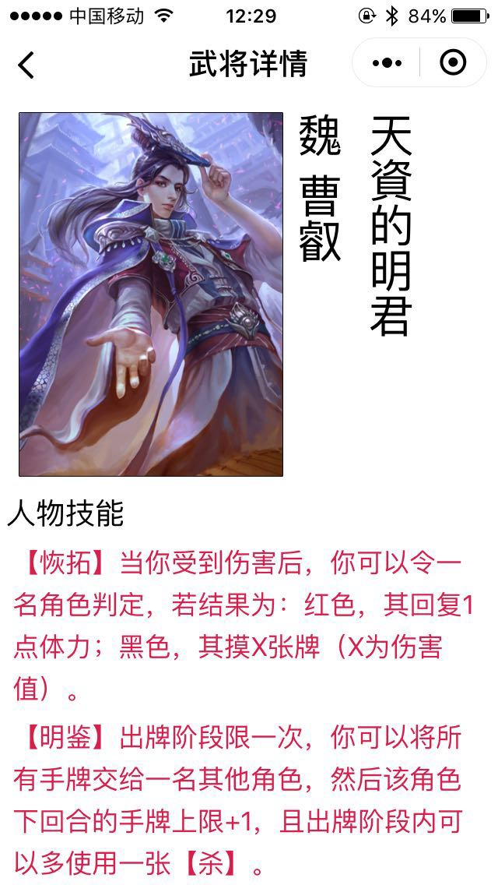
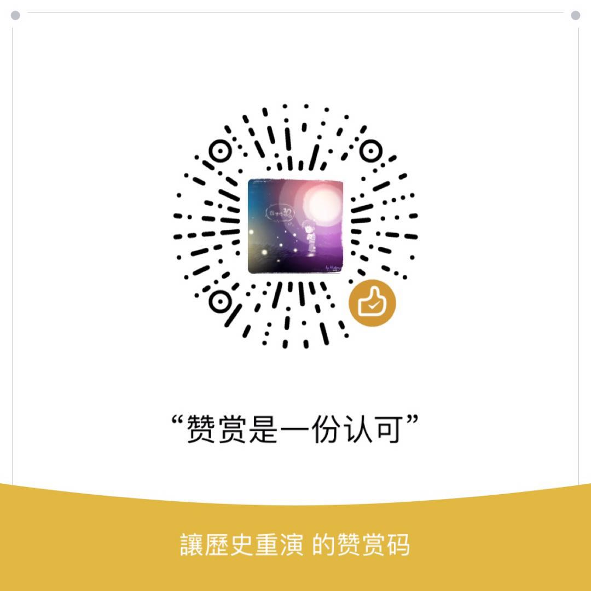

# 三国武将手册

### 三国武将手册小程序

> 作者出于对三国杀的喜爱，所以做了这款小程序，也希望可以和更多喜爱三国杀的同学一起交流、学习。

三国武将手册是一个可以随时随地查看三国杀武将技能介绍的小程序，后期会加上武将皮肤，台词等等。

## 立即体验

## 截图

## 开发使用说明

1. 若未安装微信开发中者工具需先安装微信开发者工具。
2. Clone 项目，使用微信开发者工具新建项目，选择项目目录即可。

## 项目介绍

数据存储使用`LeanCloud`，由于作者使用的是免费的环境，所以请大家不要随意使用项目的`key`和`id`。
所有的数据都是作者人工从三国杀桌面版拷贝出来的，暂时尚未整理完毕，主要是耗时和图片资源不全。后期会考虑将所有的数据导出来开源。

所有的无水印武将皮肤原画皆来源于网络，如果有涉及到版权问题，请与我联系。

项目中有个`pages/share`的页面，是利用`canvas`将图片、武将姓名、称号绘制上去，然后导出图片保存到手机的。其中文字的竖行排版是参考一个开源`js`库，在`utils/canvas.js`中。

## 后期规划

- SP、1V1、国战武将录入
- 武将多皮肤展示
- 武将台词数据

## 许可协议

三国武将手册小程序以附加禁止竞业限制的 GPLv2 许可证开放源代码。

本项目的授权协议禁止您使用本项目源码来开发和发布与三国武将手册业务相同或相近的小程序。

## 打赏作者

由于小程序里面有个保存图片的功能，需要下载武将皮肤，小程序`download`接口必须是`https`，`LeanCloud`对于`https`下载资源是付费的，所以该功能已经让作者付了一定的费用。

如果你觉得该小程序对你有帮助，或者该源码对你有帮助，请随意打赏~

## 与我联系

最后如果大家对这个小程序有什么疑问，或者建议，可以加我微信，备注`三国杀`，我会拉大家进群来沟通。

如果你是杀友，也可以加我微信，大家一起来玩耍~

